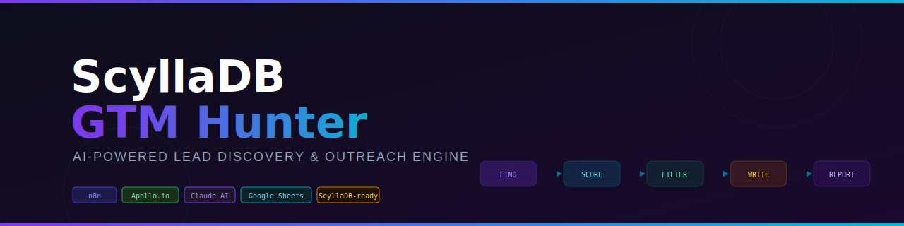

# ScyllaDB GTM Hunter (by Althay Ramallo)

> An automated, AI-powered workflow with N8N that finds potential customers using a competitor's product, scores them by how likely they are to switch, writes them personalized messages, and logs everything — without sending a single real email.

---

## What Is This?

Imagine you're a salesperson at ScyllaDB. Your job is to find engineers and decision-makers who are currently using DataStax (a competitor) and convince them to switch. Doing this manually — searching LinkedIn, reading profiles, writing individual messages — would take hours per person.

This project automates that entire process. It:

1. **Finds** DataStax users automatically via API
2. **Reads** their LinkedIn profiles to understand who they are
3. **Scores** each person 0–100 based on how likely they are to be a good prospect
4. **Writes** a personalized LinkedIn message and follow-up email for each qualified person
5. **Logs** everything to a spreadsheet and generates a campaign report. Ideally the output could be sent to a more structured database or even the Salesforce or equivalent CRM tool.
6. **Never sends** anything real — it's a "dry run" that shows exactly what would happen

The whole thing runs with one click inside n8n, a visual workflow tool. No coding required to run it.

---

## The Pipeline — How It Works Step by Step

```
┌─────────────────────────────────────────────────────────────────────────────────┐
│                        SCYLLADB GTM HUNTER PIPELINE                            │
├──────────┬──────────┬──────────┬──────────┬──────────┬──────────┬──────────────┤
│ STAGE 1  │ STAGE 2  │ STAGE 3  │ STAGE 4  │ STAGE 5  │ STAGE 6  │   STAGE 7   │
│  TRIGGER │  FIND    │  ENRICH  │  SCORE   │  FILTER  │  WRITE   │   REPORT    │
│          │          │          │          │          │          │             │
│ You click│ Apollo   │ LinkedIn │ Claude   │ IF score │ Claude   │ Google      │
│ "Execute"│ API      │ RapidAPI │ AI rates │ ≥ 50?    │ writes   │ Sheets log  │
│          │ searches │ adds     │ each     │          │ LinkedIn │ + JSON      │
│          │ for      │ profile  │ lead     │ YES →    │ invite   │ report      │
│          │ DataStax │ bio,     │ 0–100    │ continue │ + email  │ generated   │
│          │ users    │ posts,   │ with     │          │          │             │
│          │          │ skills   │ reasoning│ NO →     │          │             │
│          │          │          │          │ skip+log │          │             │
└──────────┴──────────┴──────────┴──────────┴──────────┴──────────┴─────────────┘
```


---

## Built With

| Tool | Role |
|---|---|
| [n8n](https://n8n.io) | Workflow orchestration — visual, self-hostable, exportable |
| [Apollo.io](https://apollo.io) | B2B lead discovery — 275M+ professional profiles |
| [RapidAPI LinkedIn Data API](https://rapidapi.com) | LinkedIn profile enrichment |
| [Claude (Anthropic)](https://anthropic.com) | AI lead scoring + personalized message generation |
| [Google Sheets](https://sheets.google.com) | Data storage and campaign reporting (PoC) |


## How We Identify Leads

### The Logic

We don't randomly search for anyone. We're specifically hunting for people who:

- **Use DataStax or Apache Cassandra** — these are the users who already understand the problem ScyllaDB solves, making them warm prospects rather than cold ones
- **Hold a role that influences database decisions** — a VP of Engineering can approve a switch; a junior frontend developer cannot
- **Are active** — someone who recently posted about database pain points is far more likely to respond than someone who's been silent for a year

### The Tools

**Apollo.io** is a B2B data platform with 275M+ professional profiles. We send it a search query:

```
Keywords: "DataStax" OR "Astra DB" OR "Apache Cassandra"
Titles: Data Engineer, Backend Engineer, SRE, Platform Engineer,
        Database Administrator, Solutions Architect, VP Engineering
```

This returns a list of real people matching those criteria — with their name, title, company, and LinkedIn URL. Importantly, **this type of search doesn't consume credits** on Apollo's free tier.

**RapidAPI LinkedIn Enrichment** then fetches each person's full LinkedIn profile — their bio, recent posts, skills, and connection count. This is what makes personalization actually personal.

**Mock data fallback:** If you don't have API keys, the workflow includes 8 pre-built test leads (5 qualified, 3 correctly filtered out) so you can see the full pipeline run without any accounts.

---

## How Messages Are Personalised

### The Scoring System

Before writing any message, Claude AI reads each person's full profile and rates them on 4 criteria:

| Criterion | Max Score | What We're Looking For |
|---|---|---|
| **Role Relevance** | 30 pts | Can this person influence or approve a database change? A CTO scores 30. A junior dev scores 2. |
| **DataStax Depth** | 30 pts | How deeply are they using DataStax? Running 300 nodes scores high. Mentioning Cassandra once scores low. |
| **Seniority & Influence** | 20 pts | Can they champion a technology switch internally? Budget authority matters. |
| **Activity Recency** | 20 pts | Have they posted recently about database challenges? Active pain = active prospect. |

**Total: 0–100.** Leads scoring below 50 are logged as "skipped" with a reason. This is deliberate — it proves the filter works.

### Why This Approach Is Better Than "Send to Everyone"

The two intentionally low-scoring leads in the mock data demonstrate this:
- **James O'Brien** (Junior Frontend Dev, score: 8) — gets filtered out. He has no database authority.
- **Tom Williams** (DataStax Marketing Employee, score: 35) — gets filtered out. He's a competitor employee, not a prospect.

If the system approved everyone, it would be useless. The scoring makes it intelligent.

### The Message Generation

For each **qualified lead**, Claude writes two messages:

**LinkedIn Connection Request (≤300 characters)**
- References something specific from their profile or recent posts
- No sales pitch — just a human connection
- Avoids clichéd openers ("I noticed", "I saw your profile")
- Peer-to-peer tone, technically credible

**Follow-up Email (after connection is accepted)**
- Identifies 1–2 specific pain points from their profile
- Positions ScyllaDB as the solution to *their* problem, not as a generic product
- References customer logos relevant to their industry (Discord, Starbucks, Comcast)
- Soft call-to-action: 15-min call or case study, never a hard "book a demo"
- Under 200 words

See [`prompts/PROMPTS.md`](prompts/PROMPTS.md) for the full prompt text and detailed design rationale.

---

## The Dry Run — Seeing Output Without Sending Anything

This is important: **no real messages are  sent.** Everything runs in simulation mode. To actually send messages in production you would need to add a LinkedIn API node or an email node (like Gmail or SendGrid) as an extra step at the end.

Here's what the dry run produces:

### 1. n8n Execution Log (Console)
Every time you click "Execute Workflow", n8n shows a live log of every node running. Each lead appears with its score and the generated messages. You can click any node to see exactly what data flowed through it.

### 2. Google Sheets Log (Database)
Two tabs are automatically populated:

**"Campaign Log" tab** — qualified leads with all messages:

| Name | Company | Role | Score | LinkedIn Invite | Email Subject | Status |
|---|---|---|---|---|---|---|
| Raj Gupta | AdTech Dynamics | VP Engineering | 91 | "Hi Raj — saw your post about DataStax costs eating margins..." | "The database cost problem you posted about — there's a faster fix" | simulated |
| Sarah Chen | Fintech Corp | Sr. Data Engineer | 85 | "Hi Sarah — your article on Cassandra GC pauses was spot on..." | "Those GC pauses you wrote about — what if they just disappeared?" | simulated |

**"Skipped Leads" tab** — filtered leads with reasons:

| Name | Company | Role | Score | Reason |
|---|---|---|---|---|
| James O'Brien | Web Agency | Jr. Frontend Dev | 8 | No database authority or Cassandra exposure |
| Tom Williams | DataStax | Marketing | 35 | Competitor employee |

### 3. Campaign Report File (`output/campaign_report.json`)
A JSON summary is generated at the end of every run. See [`output/sample_campaign_report.json`](output/sample_campaign_report.json) for an example.

### 4. Dry Run Log (`output/dry_run_log.txt`)
A human-readable text file showing exactly what would have been sent to each person. See [`output/sample_dry_run_log.txt`](output/sample_dry_run_log.txt) for an example. 
You can also see an example of Google sheets output in the file ScyllaDB_GTM_Hunter_Sample_Output.xlsx

## Why n8n?

n8n is a visual workflow automation tool — think of it like a flowchart where each box actually does something. We chose it for this project for specific reasons:

**For the reviewer:** The entire logic is visible on a canvas. You don't need to read code to understand what the workflow does — you can see every step, every connection, every decision point at a glance.

**For the builder:** n8n has built-in connectors for every service we use — Apollo (HTTP Request), Claude/OpenAI (AI nodes), Google Sheets, and Postgres. No boilerplate code needed to connect APIs.

**For reproducibility:** The entire workflow is exported as a single JSON file (`workflows/scylladb-gtm-hunter.json`). Anyone can import it into their n8n instance and have the full workflow running in minutes.

**For iteration:** Want to change the scoring threshold from 50 to 70? Change one number in the IF node. Want to test a different email tone? Edit the prompt in one node. No deployments needed.

**For production scaling:** n8n supports scheduling (run every Monday morning), error handling, retries, and webhook triggers. The same workflow that runs as a PoC can grow into a production system.

---

## The Database — Google Sheets Now, ScyllaDB Later

### Current Setup: Google Sheets

For this PoC, Google Sheets serves as the database. It's free, requires no setup beyond connecting a Google account, and the output is immediately readable as a formatted table. It's the right choice for a proof of concept.

### When to Switch to ScyllaDB

ScyllaDB as a database backend makes sense when:

| Scenario | Why ScyllaDB |
|---|---|
| **Processing 1,000+ leads per run** | Google Sheets has row limits and slows down; ScyllaDB handles millions of rows with sub-millisecond writes |
| **Running the workflow in real-time** (e.g., triggered by a CRM event) | ScyllaDB's low latency handles bursts of concurrent writes without queuing |
| **Multiple team members reading/writing simultaneously** | ScyllaDB scales horizontally; Sheets is single-writer |
| **Building analytics on top of the data** | ScyllaDB integrates natively with data pipelines; Sheets requires manual exports |
| **Needing 99.99% uptime** | ScyllaDB is multi-node by design; Sheets goes down with Google outages |

 Using ScyllaDB as the backend for a ScyllaDB GTM tool can also be used as compelling story for targeting other GTM prospects — we are using this interview usecase to demonstrate the ramifications and connections we can do demonstrating the product's use case while building the tool. The SQL schema and migration path are documented in [`docs/IMPLEMENTATION_GUIDE.md`](docs/IMPLEMENTATION_GUIDE.md).

---

## Sample Output

After running with 8 mock leads, here's what the output looks like:

### Campaign Funnel

```
Total Leads Discovered:    8
Total Qualified (≥50):     5   (62.5% qualification rate)
Total Skipped (<50):       3
LinkedIn Invites Written:  5
Follow-up Emails Written:  5
Total Messages Generated:  10
Delivery Mode:             SIMULATED — nothing sent
```

### Generated Messages (Examples)

**Raj Gupta — VP Engineering, AdTech Dynamics (Score: 91)**

*LinkedIn Invite (287 chars):*
> "Hi Raj — your post about DataStax costs jumping 40% this year caught my attention. We work with ad-tech teams running Cassandra at scale who've cut infrastructure costs 60–80% without touching their CQL code. Would love to connect and compare notes."

*Email Subject:* "The database cost problem you posted about — there's a faster fix"

*Email Body:*
> "Hi Raj, thanks for connecting. Your post about DataStax costs increasing 40% resonated — it's a pattern we see constantly in ad-tech.
>
> At ScyllaDB, we've helped teams in similar positions get the same Cassandra throughput on 3–5x fewer nodes, which typically means 60–80% lower infrastructure spend. We're a drop-in CQL replacement, so there's no rewrite.
>
> Comcast made this switch for their real-time bidding pipeline — happy to share the case study if useful. Or if a 15-min call makes more sense, I'm easy to reach.
>
> Either way, good luck solving the cost problem — it's a real one."

---

**James O'Brien — Junior Frontend Dev, Web Agency (Score: 8) → SKIPPED**

> *Reasoning: No database authority or Cassandra exposure. Frontend role with no infrastructure involvement. Correctly filtered out.*

---

## Quick Start

### Option A: n8n Cloud (No Installation)

1. Sign up at [n8n.io](https://n8n.io) — free trial available
2. Import `workflows/scylladb-gtm-hunter.json` (three-dot menu → Import from File)
3. Add your credentials (see below)
4. Click **Execute Workflow**

### Option B: Self-Hosted with Docker

```bash
git clone https://github.com/RFNOACH/scylla-gtm-hunter.git
cd scylla-gtm-hunter
cp .env.example .env
# Edit .env and add your API keys
docker compose up -d
# Open http://localhost:5678
# Import workflows/scylladb-gtm-hunter.json
```

---

## Setting Up Credentials

You need to add 4 credentials in n8n (**Settings → Credentials → + Add Credential**):

### 1. Apollo.io API Key
- Go to [app.apollo.io/#/settings/integrations/api](https://app.apollo.io/#/settings/integrations/api)
- Copy your API key
- In n8n: Create **HTTP Header Auth** → Name: `Apollo API Key` → Header: `X-Api-Key` → Value: your key

### 2. RapidAPI Key (LinkedIn Enrichment)
- Go to [rapidapi.com](https://rapidapi.com) → search "LinkedIn Data API" → subscribe (free tier)
- Copy your `X-RapidAPI-Key` from the API dashboard
- In n8n: Create **HTTP Header Auth** → Name: `RapidAPI Key` → Header: `X-RapidAPI-Key` → Value: your key

### 3. Anthropic API Key (Claude AI)
- Go to [console.anthropic.com/account/keys](https://console.anthropic.com/account/keys)
- Create a new key
- In n8n: Create **HTTP Header Auth** → Name: `Anthropic API Key` → Header: `x-api-key` → Value: your key

### 4. Google Sheets
- In n8n: Create **Google Sheets OAuth2** → follow the Google authentication flow
- Create a spreadsheet called **"ScyllaDB GTM Hunter"** with two tabs: `Campaign Log` and `Skipped Leads`
- Copy the spreadsheet ID from the URL and paste it into both Google Sheets nodes in the workflow

### No API Keys? Use Mock Data

Disconnect the **Apollo.io** node and connect the **"Mock Data Fallback"** node instead. The workflow runs end-to-end with 8 pre-built test leads — no accounts needed.

---

## Repository Structure

```
scylla-gtm-hunter/
├── README.md                         ← You are here
├── docker-compose.yml                ← One-command n8n setup
├── .env.example                      ← API keys template
├── .gitignore
├── assets/
│   └── banner.svg                    ← README header image
├── workflows/
│   └── scylladb-gtm-hunter.json     ← THE MAIN DELIVERABLE — import into n8n
├── prompts/
│   └── PROMPTS.md                   ← All 3 AI prompts + design rationale
├── data/
│   └── mock_leads.json              ← 8 test leads for demo without API keys
├── output/
│   ├── sample_dry_run_log.txt       ← Example of what the console output looks like
│   └── sample_campaign_report.json  ← Example of the final campaign report
└── docs/
    └── IMPLEMENTATION_GUIDE.md      ← Node-by-node technical walkthrough
```

---

## Considerations & Recommendations

### What Works Well
- The 4-criteria scoring rubric produces calibrated, defensible scores — not random noise
- Passing the scoring `reasoning` into message prompts creates a "chain of thought" that makes messages genuinely relevant
- The mock data fallback means anyone can demo the system without API access
- Logging skipped leads (not just qualified ones) gives full pipeline visibility

### Known Limitations of the PoC
- **Apollo free tier is limited** — 50 export credits/month. For a real campaign, you'd need a paid plan
- **LinkedIn enrichment can fail** — private profiles or rate limits cause empty enrichment; the workflow handles this gracefully by falling back to Apollo data
- **Google Sheets isn't a real database** — it breaks at scale, has no query language, and has concurrent write issues. See ScyllaDB migration path in the Implementation Guide
- **No deduplication** — if you run the workflow twice, you'll get duplicate rows. A real system needs a `lead_id` uniqueness check

### What to Build Next (Production Roadmap)
1. **Deduplicate leads** — check Google Sheets / database before inserting a new lead
2. **Add a CRM integration** — push qualified leads to HubSpot or Salesforce automatically
3. **Schedule it** — replace Manual Trigger with a Schedule Trigger (weekly on Monday morning)
4. **A/B test messages** — duplicate the message generation node with a different prompt variant, track which version gets more replies
5. **Email verification step** — add ZeroBounce or similar before any outreach to avoid bounces
6. **Migrate to ScyllaDB** — for anything beyond 500 leads/month, swap Google Sheets for a ScyllaDB cluster. The schema is ready in the Implementation Guide
7. **Deploy to a VPS** — $5/month Hetzner or DigitalOcean box, n8n behind nginx with SSL

---

---

## The Prompts Used to Build This

The AI prompts used inside the workflow are fully documented in [`prompts/PROMPTS.md`](prompts/PROMPTS.md), including:
- The full text of all 3 prompts
- Why each prompt is structured the way it is
- Anti-patterns deliberately avoided
- What to improve in a production version

---

*Built as a GTM Engineer assignment PoC. Dry-run mode only — no real messages sent.*
